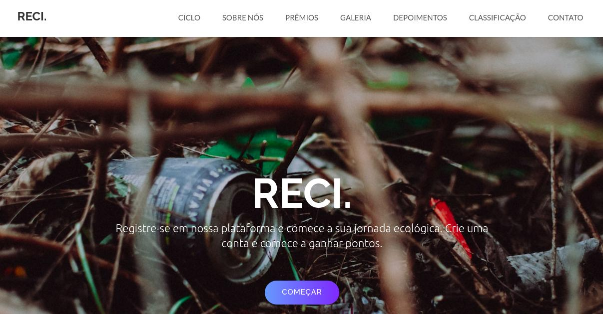

<h1 align="center">
Plataforma ESG Reci.
</h1>

Projeto desenvolvido a partir dos módulos estudados do curso Sistema para Internet

  <a href="#-tecnologias">Tecnologias</a>&nbsp;&nbsp;&nbsp;|&nbsp;&nbsp;&nbsp;
  <a href="#-layout">Aplicação</a>&nbsp;&nbsp;&nbsp;|&nbsp;&nbsp;&nbsp;  
  <a href="#documentação">Documentação</a>&nbsp;&nbsp;&nbsp;|&nbsp;&nbsp;&nbsp;
  <a href="#memo-licença">Licença</a>

  

 

  

## 🚀 Tecnologias

Esse projeto foi desenvolvido com as seguintes tecnologias:

Backend:

- [Node.js](https://nodejs.org/en)
- [Express](https://expressjs.com/)
- [TypeScript](https://expressjs.com/)
- [MongoDB](https://www.mongodb.com/)

Frontend:

- [ReactJS](https://react.dev/)
- [Writesonic](https://writesonic.com)

Mobile:

- [React-Native](https://reactnative.dev/)
- [Expo](https://expo.dev/)
- [TypeScript](https://expressjs.com/)

API REST:

- [Postman](https://www.postman.com/)

## 💻 Aplicação

A Plataforma ESG Reci tem a finalidade de promover ações de boas práticas para o descarte de lixo. Os usuários podem se cadastrar e divulgar suas ações de boas práticas, ganhando pontos que podem ser trocados por brindes. Além disso, os usuários ficam em uma classificação que pode ser vista por outros.

## 📄 Documentação

- Backend
O backend da Plataforma ESG Reci é desenvolvido com Node.js, Express e TypeScript. Ele é responsável por gerenciar a lógica de negócio, as rotas da aplicação e a comunicação com o banco de dados MongoDB.

- Frontend
O frontend utiliza ReactJS e TypeScript, fornecendo uma interface de usuário interativa e responsiva. A integração com o backend é feita através de chamadas de API REST.

- Consumo de API
Para testar e documentar as APIs, utilizamos o Postman. Ele facilita a validação das rotas e a comunicação entre o frontend e o backend, garantindo que os dados fluam corretamente.

- Banco de Dados
Utilizamos o MongoDB como banco de dados NoSQL, que é ideal para armazenar dados não estruturados e garantir escalabilidade e performance. A conexão com o MongoDB é gerenciada pelo backend, onde os dados de usuários, ações e pontuações são armazenados.

- Versão Mobile/App
Para a versão mobile da Plataforma ESG Reci, utilizamos React Native com Expo, que permite o desenvolvimento de aplicativos multiplataforma (iOS e Android) com um único código base. O uso de TypeScript melhora a manutenção e a escalabilidade do código.

## :construction: Plano de Marketing Digital para Lançamento

- Identificação do Público-Alvo: Identificar grupos de pessoas e comunidades interessadas em práticas sustentáveis e responsabilidade ambiental.
- Criação de Conteúdo: Desenvolver conteúdo educativo e informativo sobre a importância da reciclagem e práticas sustentáveis.
- Redes Sociais: Utilizar plataformas como Instagram, Facebook, LinkedIn e Twitter para promover a plataforma, compartilhando histórias de sucesso de usuários e dicas de sustentabilidade.
- Parcerias: Formar parcerias com ONGs, escolas e empresas para promover a plataforma.
- SEO: Otimizar o site para motores de busca para aumentar a visibilidade orgânica.
- Anúncios Pagos: Investir em campanhas de anúncios pagos nas redes sociais e Google Ads para alcançar um público maior.
- Engajamento da Comunidade: Incentivar os usuários a compartilhar suas ações nas redes sociais usando hashtags específicas da plataforma.

## :memo: Licença

Esse projeto está sob a licença MIT.

---

Feito com ♥ by [Gisele Araujo Silva](https://www.linkedin.com/in/gisele-araujo-silva/) e [Vitória Ferreira](https://www.linkedin.com/in/vic-ferreira/)
